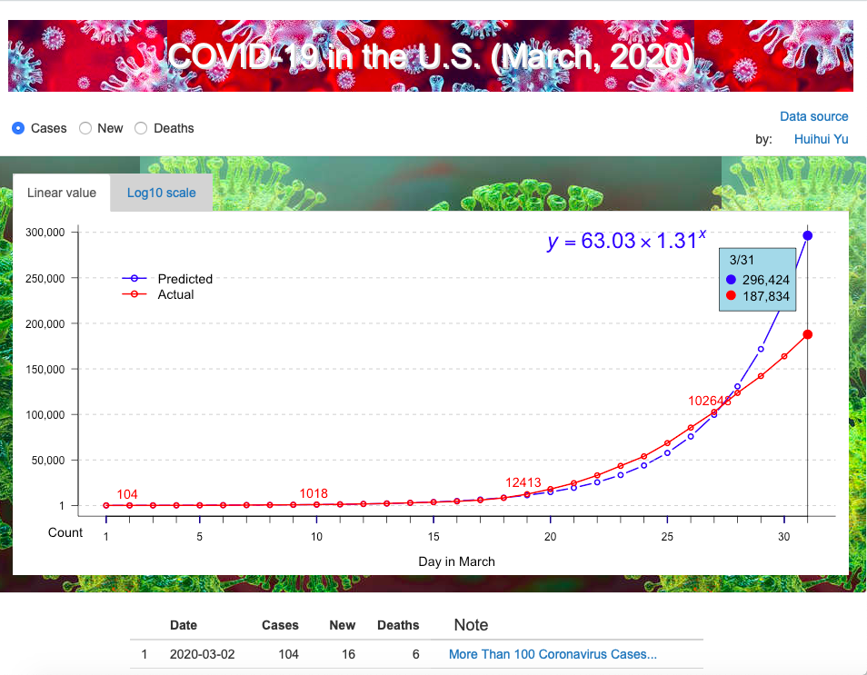

# covid-19_us: COVID-19 in the U.S. (March, 2020)

This is the source of a small app in shinyapps: 

### https://yuhuihui2011.shinyapps.io/covid-19_us/

To run the app locally, you can install the **shiny** package in R, and
use the function `runGitHub()`:

```R
if (!require('shiny')) install.packages("shiny")
shiny::runGitHub("yuhuihui2011/covid-19_us")
```

Or you can clone or download this repository, and use run
`shiny::runApp("covid-19_us")`.




